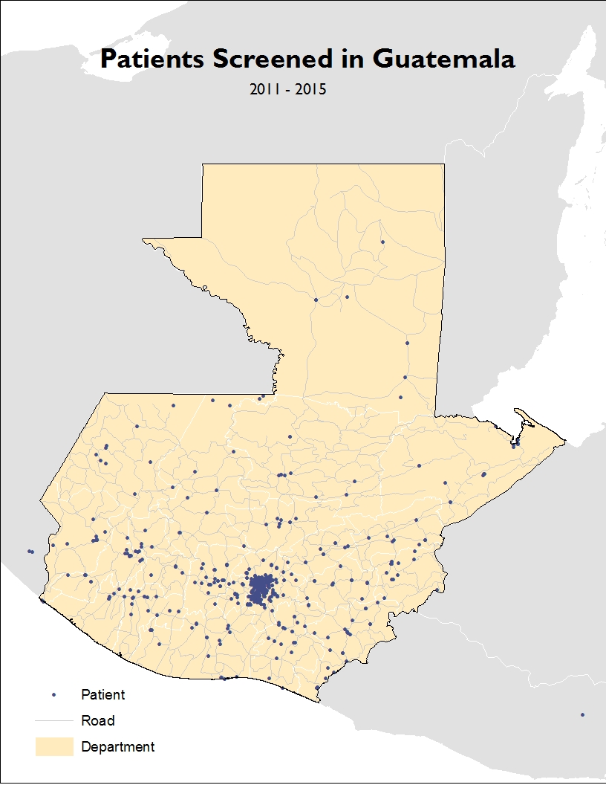

## Work Examples

---

### <a href="https://agbrad.github.io/FieldMapping/" target="_blank">Field Mapping</a>

 
<b>Philippines</b> 
Operation Smile began programs in the Philippines in 1982, and since then has cared for thousands of patients. As the Philippines changed, the organization and the programs evolved to better meet their needs. In 2014, the organization hosted 6 missions at the same time. This was an opportunity to better understand the actual catchment area of mission sites, in order to more strategically locate programs in the future. I led an initiative to work with local volunteers who staffed each of the 6 sites. As patients were screened, the volunteers plotted on Field Papers where a sample of the patients' homes were. After the missions, we digitized those Field Papers and were able to target new areas that were in need of care.

---

 
<b>Malawi</b> 
Malawi's community health worker population is a critical component of identifying patients born with cleft lip and cleft palate. I spent time with the staff at the Operation Smile office in Malawi and supported their development an OpenDataKit app to collect the information of new patients. We then traveled to different regions of Malawi to provide training on the app and continue to plan improvements. This has allowed the team in Malawi to provide more accessible follow-up care to patients.

---

 
<b>Guatemala</b> 
Much of Guatemala's healthcare is concentrated around Guatemala City. Our staff in Guatemala used a third party research organization to gather data from health clinics in more remote areas about patients with cleft lip and cleft palate. I worked with the research team to ensure the data being collected was appropriate and relevant, providing best practices from other effective patient registries.

---

Page template forked from <a href="https://github.com/evanca/quick-portfolio">evanca</a>

<!-- Remove above link if you don't want to attibute -->
